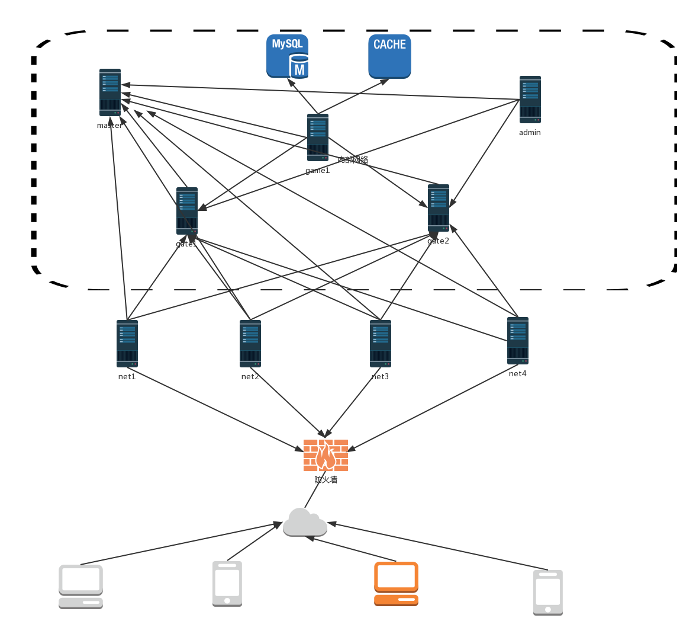

# xingo_cluster
xingo地址：(https://git.oschina.net/viphxin/xingo)<br>
xingo cluster 分布式集群 示例代码<br>
```json
启动服务器集群：
go run master.go
go run server.go gate1
go run server.go gate2
go run server.go net1
go run server.go net2
go run server.go net3
go run server.go net4
go run server.go admin

启动测试脚本:
go run client_test1.go
```
示例配置:<br>
```json
{
    "master":{"host": "192.168.2.225","rootport":9999},
    "servers":{
        "gate2":{"host": "192.168.2.225", "rootport":10000,"name":"gate2", "module": "gate", "log": "gate2.log"},
        "gate1":{"host": "192.168.2.225", "rootport":10001,"name":"gate1", "module": "gate", "log": "gate1.log"},
        "net1":{"host": "192.168.2.225", "netport":11009,"name":"net1","remotes":["gate2", "gate1"], 
                    "module": "net", "log": "net.log"},
        "net2":{"host": "192.168.2.225", "netport":11010,"name":"net2","remotes":["gate2", "gate1"], 
                    "module": "net", "log": "net.log"},
        "net3":{"host": "192.168.2.225", "netport":11011,"name":"net3","remotes":["gate2", "gate1"], 
                    "module": "net", "log": "net.log"},
        "net4":{"host": "192.168.2.225", "netport":11012,"name":"net4","remotes":["gate2", "gate1"], 
                    "module": "net", "log": "net.log"},
        "admin":{"host": "192.168.2.225", "remotes":["gate2", "gate1"], "name":"admin", "module": "admin", 
            "http": [8888, "/static"]},
        "game1":{"host": "192.168.2.225", "remotes":["gate2", "gate1"], "name":"game1", "module": "game"}
    }
}
```
架构图：<br>

